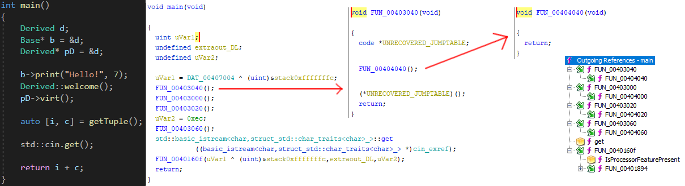

# Hidecall

Hidecall is single-header C++ library that obfuscates function calls and
hides them in decompilation, what makes reverse-engineering very ~~hard~~ annoying.

It is developed and supported for MSVC compiler and x86 program architecture

## Usage

In order to apply Hidecall, modify function definition signature as follows:
```cpp
#include "hidecall.h"

//Before
static int foo(int a, char b)
{
    //Your code
}

//After
HIDECALL(static, int, foo, (int a, char b))
{
    //Your code
}
```
Basically you wrap your function signature into a macro and split it using commas:
- before return type
- before name
- after name

Use PACK() macro if return type has comma inside.

That's it! You don't have to modify any code other than that.
You can even use it for main entry function as well, there are no restrictions about it.

Your function should work exactly the same way as before applying hidecall. If something works differently, let me know by opening an issue.

For explanation visit [hidecall.h](include/hidecall/hidecall.h) and for more examples see [example.cpp](examples/example.cpp)

### Configuration

Before using, visit [hidecall.h](include/hidecall/hidecall.h) and change preprocessor definitions to your own preferences in *HC_CONFIG* region.

### Decompilation

Using HIDECALL makes following changes in decompilation:
- Removes function references
- Cuts off call paths
- Removes auto parameter deduction

There is an example decompilation:


I tested it on some decompilers, including Ghidra, JEB, Snowman, Retdec and they are all fooled.

PS: I don't have IDA so i couldn't check it there.

### Types

Types of HIDECALL:

- __HIDECALL_DECLARE__ - hidecall function declaration
- __HIDECALL__ - hidecall definition for functions
- __HIDECALL_LEVEL__ - as above, but with external linenumber concatenation level
- __HIDECALL_CLASS__ - hidecall definition for class member functions
- __HIDECALL_CLASS_LEVEL__ - as above, but with external linenumber concatenation level

### Limitations

- No support for lambdas
- No support for x64 architecture, x86 only

### Consequences

- __MESS__ inside a namespace, because hidecall defines two additional
  functions per one protected function. That's why i suggest
  switching to hidecall after writing the actual code
- Increased compiled binary size
- Disables automatic function inlining
- A bit slower program execution (The call itself is over 2.5x slower, but the rest of the code is as fast as normal)

### Restrictions
 
- Do not use __\_\_COUNTER\_\___ in your program, because it is a part of obfuscation randomization and changing its value can break your program. If you really need it, use it 5 times in a row.

## License
Licensed under the [MIT License](LICENSE)
